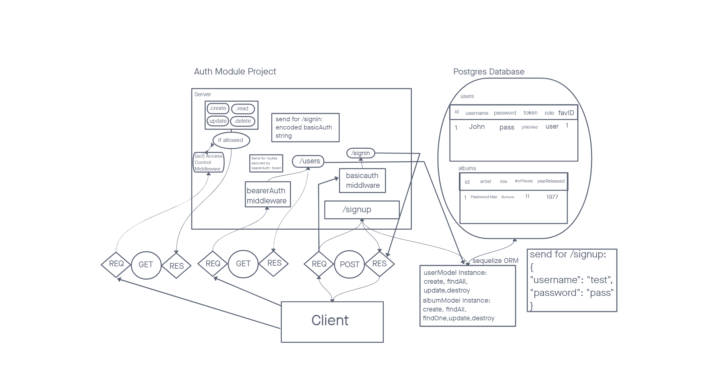

# LAB - Class 08

## Project: Album Database

### Author: Steven Rejdukowski, Megan Faith Seibert-Hughes

### Problem Domain

Auth Module Final Project
Create a new application using your API Server and Authentication System learnings.

Your team will be responsible for planning, executing, and presenting an application that showcases a Content Management System (CMS) using full RESTful CRUD operations.

The Goal and The Why
Time to build something cool! You’ve learned so much and as a class we’ve covered a lot of material. By giving you the opportunity to build and deploy an Auth Server, you gain fluency, foster understanding, and put your new skills to work. You may build something that looks and functions similar to lab-08, or perhaps you build something that surpasses lab-08. Either way, the goal of this lab is to reinforce any learnings that might need reinforcing.

Requirements
Your application must employ the following programming concepts:

API Auth server must be deployed. A single, backend application is expected
Use of your API server to perform database operations
Use of login/auth/acl to control access to your resources

### Links and Resources

- [ci/cd](https://github.com/Stevenrej/Album-Database/actions) (GitHub Actions)
- [prod deployment](https://album-database.onrender.com/)

#### `.env` requirements (where applicable)

PORT=3001
DATABASE_URL=postgres://localhost:5432/album16
SECRET=mySecret

#### How to initialize/run your application (where applicable)

- nodemon

#### Features / Routes

- POST - path `/album`
- GET - path `/album`
- GET - path `/album/:id`
- PUT - path `/album`
- DELETE - path `/album/:id`
- POST - path `/favorites/:id`
- POST - path `/favorites/:id/:albumId`
- GET - path `/favorites`
- GET - path `/favorites/:id`
- POST - path `/signup`
- POST - path `/signin`

#### Tests

- How do you run tests?
  - npm test

- Any tests of note?
 testing user routes and album routes

#### UML

